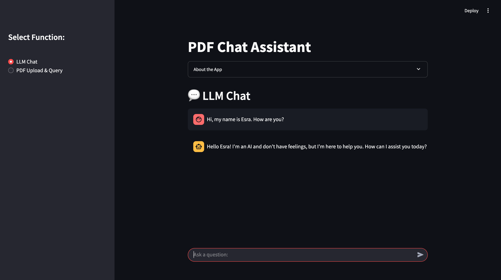
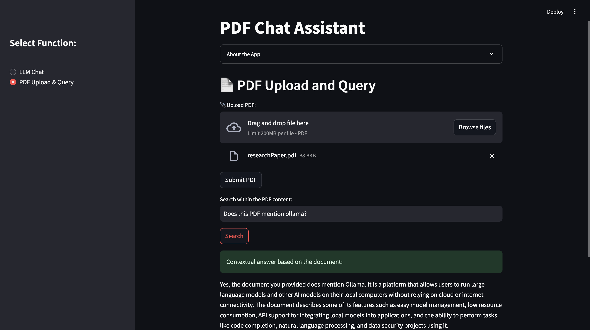

# PDF Chat Assistant (RAG-Powered)

A simple and modular **Retrieval-Augmented Generation (RAG) assistant** that allows you to:

- **Chat with a general-purpose LLM**,
- **Upload PDF documents and query them contextually** using RAG + LLM powered chatbot.

This project combines both LLM chat capabilities and PDF-based document search & Q&A in one unified application.

---
## Preview

### LLM Chat Modul


### PDF Chat Assistant Modul


---

## Features

- **LLM Chat**: Ask general questions to an LLM without document context.
- **PDF Upload & Query**: Upload PDFs and ask questions specific to the document content.
- **RAG Search Engine**: Retrieval-Augmented Generation pipeline using document embeddings.
- **Flask REST API**: Endpoints to upload PDFs and interact with the model.
- **Streamlit Frontend**: Clean UI to upload files and chat/query.
- **Simple Vector Store**: In-memory vector storage using cosine similarity.

---

## Project Structure

```bash
pdf-chat-assistant/
├── app.py                  # Flask API server 
├── config.py               # Configuration file
├── requirements.txt        # Required Python libraries
├── streamlit_app.py        # Streamlit frontend 
├── README.md               # Project explanation
└── src/                    
    ├── __init__.py
    ├── documents.py        # Document model & text splitter
    ├── pdf_reader.py       # PDF loader & parser
    ├── ollama_client.py    # Ollama API client (generation & embeddings) 
    ├── vector_store.py     # Simple in-memory vector store
    └── chat_service.py     # Chat service (LLM & RAG)
```
---

## Tech Stack

- Python 3.10+
- Flask (API)
- Streamlit (Frontend)
- Ollama API (LLM & embeddings)
- PyMuPDF (`fitz`) (PDF reading)
- scikit-learn (Cosine similarity)
- Requests (HTTP client)

---

## Setup Instructions

### 1. Install dependencies

```bash
pip install -r requirements.txt
```

### 2. Start Ollama API server (LLM backend)
Make sure you have Ollama installed and running.

```bash
ollama run mistral
```

You can adjust OLLAMA_API_BASE and MODEL_NAME in config.py

### 3. Start Flask API server
```bash
python app.py
```

### 4. Run Streamlit frontend
```bash
streamlit run streamlit_app.py
```

---

## API Endpoints

| Method | Endpoint   | Description                                  |
|--------|------------|----------------------------------------------|
| GET    | `/chat`    | General LLM chat (query via `prompt`)        |
| POST   | `/upload`  | Upload a PDF file to the vector store        |
| GET    | `/search`  | Search inside uploaded PDFs using RAG        |

---

## How it works?

General Chat
Use the "LLM Chat" mode to interact with a general-purpose LLM without document context.

PDF Upload & Query
Upload one or more PDFs via the UI or /upload API endpoint. The system extracts text, splits it into chunks, generates embeddings, and stores them in a simple vector store.
You can then search inside the document using the /search endpoint or Streamlit interface.